# eFuse-基于eBPF加速的高性能用户态文件系统

## 目录

- [一、基本信息](#一基本信息)
- [二、项目概述](#二项目概述)
  - [2.1 背景和意义](#21-背景和意义)
  - [2.2 关于 eFUSE](#22-关于efuse)
- [三、项目目标与规划](#三项目目标与规划)
  - [3.1 项目目标](#31-项目目标)
  - [3.2 项目行动项](#32-项目行动项)
  - [3.3 完成情况](#33-完成情况)
  - [3.4 项目详细推进情况](#34-项目详细推进情况)
- [四、项目架构和设计方案](#四项目架构和设计方案)
  - [4.1 原始FUSE结构分析](#41-原始FUSE结构分析)
  - [4.2 eFuse架构设计](#42-eFuse架构设计)
  - [4.3 用户态文件系统绕过模块](#43-用户态文件系统绕过模块)
  - [4.4 多核优化模块](#44-多核优化模块)
  - [4.5 设备/内核路径调度模块](#45-设备内核路径调度模块)
- [五、性能测试与评估](#五性能测试与评估)
  - [5.1 虚拟机初步测试](#51-虚拟机初步测试)
  - [5.2 物理机综合测试](#52-物理机综合测试)
- [六、项目开发文档和演示PPT](#六项目开发文档和演示PPT)
- [七、快速启动和功能展示](#七快速启动和功能展示)
- [八、目录索引](#八目录索引)
- [九、致谢](#九致谢)


## 一、基本信息

| 赛题 | [proj289 基于内核态/用户态 eBPF 实现高性能用户态文件系统功能](https://github.com/oscomp/proj289-High-performance-user-mode-file-system) |
| :-: | :-: |
| **队伍名称** | FastPoke |
| **项目名称** | eFuse |
| **小组成员** | 许辰涛、冯可逸、赵胜杰 |
| **项目导师** | 郑昱笙 |
| **校内导师** | 夏文、李诗逸 |

  FUSE（Filesystem in Userspace）是目前广受欢迎的一个用户态文件系统框架，但FUSE在高频负载场景下受限于频繁的用户态/内核态切换和请求提交时的锁争用，性能表现不佳。

  为此，我们提出eFuse，一个结合eBPF技术的FUSE性能优化方案，尝试在FUSE工作流程中的各个环节着手优化。其中包括**通过eBPF map实现文件元数据和文件内容在内核中的缓存**，**在内核eBPF程序中对FUSE请求快速处理**，**设计更为合理的内核请求队列结构**，**优化请求处理和调度管理**，**IO堆栈智能调度**。提升各个负载场景下FUSE的性能和可扩展性，相比原始FUSE**性能提升约3倍**。
  
  上述设计和功能实现不改变原本FUSE的架构和接口标准，能够实现对现有FUSE的完全兼容，适配原有的所有基于FUSE实现的用户态文件系统，简单易用。

## 二、项目概述

### 2.1 背景和意义

FUSE（Filesystem in Userspace）是一种允许在用户态构建文件系统的linux机制，使开发者能够在不必修改内核源码的条件下，便捷且灵活地开发自定义文件系统，极大地降低了开发门槛，简化了开发流程，提高了内核安全性。然而，FUSE 的性能瓶颈一直备受诟病，尤其在高频繁元数据操作、大量小文件读写等场景下，**内核态与用户态频繁切换成为主要性能瓶颈**，限制了其在特定的高性能场景下的适用性。

在 FUSE 内部的实现中，来自 VFS (虚拟文件系统) 层的所有请求都被放入共享的待处理队列 (pending queue) 中，并由 FUSE 守护进程逐个提取。这种调度方式**在某些高并发的场景下会导致严重的锁争用**。在多核环境下，无法充分发挥多核处理器的并行优势，使得系统在面对大规模的I/O任务时吞吐率首先，处理时延较高，无法充分利用带宽的潜力。

eBPF（extended Berkeley Packet Filter）是 Linux 的一项强大特性，允许开发者在不修改内核源码的情况下向内核注入用户定义逻辑，已广泛应用于网络、安全、追踪等领域，eBPF 为解决和优化上述 FUSE 的性能问题提供了新的可能和方向。近年来，已有多项研究探索将 eBPF 引入文件系统以提升其性能，例如 ExtFuse、Fuse-BPF、XRP 等。我们期望通过本项目，进一步探索基于 eBPF 的 FUSE 加速路径，**实现低延迟、高吞吐、具有良好扩展性的用户态文件系统**。

### 2.2 关于eFUSE

eFuse 是一个尝试将 eBPF 深度集成到 FUSE 文件系统中的创新项目，旨在重构 FUSE 的传统执行路径和请求调度方式，以提高用户态文件系统的运行效率，同时保留 FUSE 的灵活性和安全性的优势。借助 eBPF 这一灵活的特性，对特定的文件系统进行性能优化，实现以下三大目标：
- **减少内核态与用户态之间的频繁切换**

  在内核中直接处理部分 FUSE 请求（如 LOOKUP、READ 等），避免传统 FUSE 工作流程中频繁的内核/用户态切换，提高请求处理效率。

- **设计高效的 I/O 和元数据缓存机制**

  利用 eBPF 的 map 数据结构实现元数据和读写数据的缓存机制，降低磁盘的访问频率。

- **实现跨核高并发优化与负载均衡机制**

  针对 FUSE 共享请求队列带来的并发限制，设计更为合理、更适合多核的请求调度方式，并结合 eBPF 进行负载监控，避免锁的集中争用。 

相比传统 FUSE 和相关研究，eFuse 具有如下优势：

* 保留传统 FUSE 的灵活性和可移植性
* 避免对内核的大范围改动，对用户友好
* 用户可为不同的 FUSE 请求动态注册钩子函数，具有强大的可编程性
* 完全兼容现有的 FUSE 应用
* 高性能，能够充分发挥带宽能力，适用于各种负载场景
* 适配多核 CPU 的现代硬件环境
* 可动态制定 FUSE 请求的拥塞调度策略，灵活性高
* 安全性保障完善

## 三、项目目标与规划

### 3.1 项目目标
为实现上述目标，进一步将本项目分为六大技术目标模块，完成情况如下：

| 实现内容                                               | 完成情况 | 说明                                                                                                                                                                                                  |
| ------------------------------------------------------ | -------- | ----------------------------------------------------------------------------------------------------------------------------------------------------------------------------------------------------- |
| **目标1：FUSE 内核模块扩展** | 全部完成 <br/>100% | 1. 支持新的eBPF程序类型。 <br />2. 扩展FUSE挂载点支持。 <br /> 3. 设计并注册文件系统相关 helper 函数。 |
| **目标2：FUSE 元数据请求优化** | 全部完成 <br/>100% | 1. 优化 inode、目录、权限、路径等相关操作。（如 LOOKUP、GETATTR）<br />2. 使用 eBPF map 实现元数据缓存。 <br />3. 实现内核态与用户态高效协调访问。<br />4. 内核/用户态切换次数显著下降。 |
| **目标3：FUSE I/O 请求的特殊优化** | 全部完成 <br/>100%| 1. 支持直通路径：eBPF 直接读取文件内容。 <br />2. 支持缓存路径：将内容存入 eBPF map 缓存。 <br />3. 设计请求调度策略实现直通与缓存路径选择。<br />4. 读写性能提升 2~4 倍。 |
| **目标4：基于内核修改的多核优化**  | 全部完成 <br/>100% | 1. 为每个核心构建独立 ringbuf 管道代替请求队列。 <br />2. 实现可扩展的核间通信机制。 <br />3. 实现多核 CPU 环境的适配。 |
| **目标5：负载监控与请求均衡**   | 全部完成 <br/>100% | 1. 动态分析请求负载。<br />2. 根据 ringbuf 状态进行调度策略调整。<br />3. 针对不同的负载情况实现合理的请求分配。 |
| **目标6：I/O堆栈层面优化**   | 全部完成 <br/>100% | 1. 仿真实现具有内部计算能力的存储设备。<br />2. 在某些场景下尝试将计算下放给设备。<br />3. 实现设备端和内核端的智能调度选择。 |

### 3.2 项目行动项

我们将上述目标拆分为以下若干行动项：

- [X] 行动项 1：进行背景知识调研，了解 FUSE 的核心性能瓶颈。
- [X] 行动项 2：搭建开发环境。
- [X] 行动项 3：FUSE 内核驱动扩展、加载 eBPF 程序、设置挂载点入口。
- [X] 行动项 4：实现并注册内核 eBPF helper 辅助函数。
- [X] 行动项 5：实现 FUSE 元数据请求绕过路径和回退机制。
- [X] 行动项 6：在用户态和内核中协调访问。
- [X] 行动项 7：实现 FUSE I/O 请求 map 缓存绕过路径。
- [X] 行动项 8：实现 FUSE I/O 请求直通绕过路径。
- [X] 行动项 9：实现 FUSE I/O 请求中的自适应调度算法。
- [X] 行动项10：FUSE 请求绕过机制的安全性评估和处理。
- [X] 行动项11：为 FUSE 内核设计更为合理的请求队列数据结构。
- [X] 行动项12：实现对请求队列的负载监控和请求均衡。
- [X] 行动项13：仿真实现具有内部计算能力的 CSD 存储设备。
- [X] 行动项14：在系统内核中为 FUSE 请求添加设备路径，实现计算下移。
- [X] 行动项15：在系统内核中为传统路径和新增的设备路径实现调度算法。
- [X] 行动项16：模拟常见的负载场景，在虚拟机中进行性能评估。
- [X] 行动项17：在物理机中进行负载测试，得到真实性能结果。

### 3.3 完成情况

针对上述行动项的完成情况如下：

| 实现内容 | 完成情况 | 说明                                                                                                                  |
| -------- | -------- | --------------------------------------------------------------------------------------------------------------------- |
| 行动项1  | 完成     | 讨论并选定可行的 FUSE 优化方向。|
| 行动项2  | 完成     | 在虚拟机中搭建测试环境，基于 linux 6.5 开发。|
| 行动项3  | 完成     | 使指定文件系统在挂载时自动加载 eBPF 程序，完成eBPF程序在送往用户态文件系统时的自动触发。|
| 行动项4  | 完成     | 在内核中设计并注册合适的 eBPF helper 函数，便于后续开发，同时须确保 eBPF 程序安全性。 |
| 行动项5  | 完成     | 实现 LOOUP、GETATTR 等元数据请求的绕过机制，大幅降低文件系统在运行时的内核态/用户态切换次数。|
| 行动项6  | 完成     | 对指定的用户态文件系统做一定的修改，使其与 eBPF 程序协调配合，管理 eBPF map 中的数据内容。|
| 行动项7  | 完成     | 实现以 READ、WRITE 为主的文件 I/O 请求的 eBPF map 缓存机制，加快请求的处理速度。 |
| 行动项8  | 完成     | 实现以 READ、WRITE 为主的文件 I/O 请求的 eBPF 直通路径，作为对缓存机制的补充。 |
| 行动项9  | 完成     | 设计并实现自适应路径选择算法，使系统在不同的负载情况下预测并选择较优的路径，读写性能提升 1.5~3 倍。 |
| 行动项10  | 完成     | 对完成的请求绕过机制进行安全性检查，防止文件读取越界等情况发生，进行处理和优化。 |
| 行动项11  | 完成     | 在多核环境下为每个核心分配环形管道，代替原先的请求队列。 |
| 行动项12  | 完成     | 实现请求队列的负载监控和均衡调度，提升多核环境下的请求处理效率。 |
| 行动项13  | 完成     | 完成支持内部计算能力的 CSD 存储设备仿真。 |
| 行动项14  | 完成     | 内核中新增 FUSE 请求设备路径，在仿真设备中完成计算并返回。 |
| 行动项15  | 完成     | 新增 I/O 堆栈调度策略模块，根据请求类型、当前设备负载、先前请求情况选择路径。 |
| 行动项16  | 完成     | 设计典型常见的负载场景，在虚拟机中进行初步评估。 |
| 行动项17  | 完成     | 在物理机上进行真实负载测试，验证性能提升。 |

| **姓名** | **分工内容**  |
| -------- | -------- |
| 许辰涛 | 1. 调研现有 FUSE 优化方案 <br /> 2. eBPF 开发技术栈学习 <br /> 3. 项目仓库与依赖子仓库搭建 <br />4. ExtFUSE 的Linux 内核移植 <br />5. 将libfuse 适配eFUSE |
| 冯可逸 | 1. 开发环境搭建 <br /> 2. eBPF 开发技术栈学习 <br /> 3. 使用 eBPF 实现 FUSE 请求绕过 <br /> 4. FUSE I/O 缓存/直通 实现 <br /> 5. 初赛阶段综合性测试 |
| 赵胜杰 | 1. 理解 RFUSE 算法思想和代码架构 <br /> 2. 理解 ExtFUSE 算法思想和代码架构 <br /> 3. 复现 RFUSE 项目 <br /> 4. 在6.5.0 内核上修改内核FUSE模块 <br /> 5. 修改用户库 libfuse 整合 RFUE 和 ExtFUSE |

### 3.4 项目详细推进情况

**初赛阶段进展：**

- [X] 调研现有技术栈以及相关优秀开源项目。
- [X] 在虚拟机中搭建测试开发环境。
- [X] 深度学习eBPF开发流程和FUSE工作流程。
- [X] 在内核指定位置添加eFuse相关eBPF程序挂载点。
- [X] 在内核中实现并注册eBPF helper函数。
- [X] 初步实现FUSE元数据请求的绕过逻辑，用户态文件系统协调配合。
- [X] 实现FUSE I/O请求的绕过逻辑，包含map缓存和直通两条路径。
- [X] 设计并实现FUSE I/O请求两条路径的智能调度算法。
- [X] 设计为每个核心分配一个环形管道的优化结构。
- [X] 初步实现多核优化模块，初赛时未集成到主项目。
- [X] 进行初步的性能评估，在虚拟机中进行测试。

**决赛阶段进展：**

- 决赛阶段实现内容

- [X] 完成多核优化模块和主项目的结构统一，实现集成。
- [X] 实现请求队列的负载监控和均衡调度。
- [X] 分别尝试使用eBPF和直接在内核中完成负载监控。
- [X] 仿真实现支持内部计算能力的 CSD 存储设备。
- [X] 实现I/O堆栈层面的设备合集和内核路径调度。
- [X] 进一步丰富性能测试场景。
- [X] 部署等价的实体机测试环境，进行测试。

- 对初赛内容的改进

- [X] 对部分FUSE请求的绕过逻辑做细节优化，进一步略微提升性能。
- [X] 设计更多、更为合理的性能测试场景。
- [X] 对libfuse库和内核部分文件进行了适配多核优化模块的重构。

## 四、项目架构和设计方案

### 4.1 原始FUSE结构分析


在原始 FUSE 架构中，在应用程序发出系统调用后，首先由内核中的 VFS (Virtual File Syatem) 捕获，并发送至 FUSE 内核驱动，将其放入待处理队列中。队列中的请求依次提交给用户态文件系统处理，将处理完的结果返回内核，最终交付给应用程序。

该框架存在明显的性能瓶颈：

- 频繁的内核态和用户态切换

- 共享队列造成的锁争用

- 缺乏并行和本地缓存机制

### 4.2 eFUSE架构设计

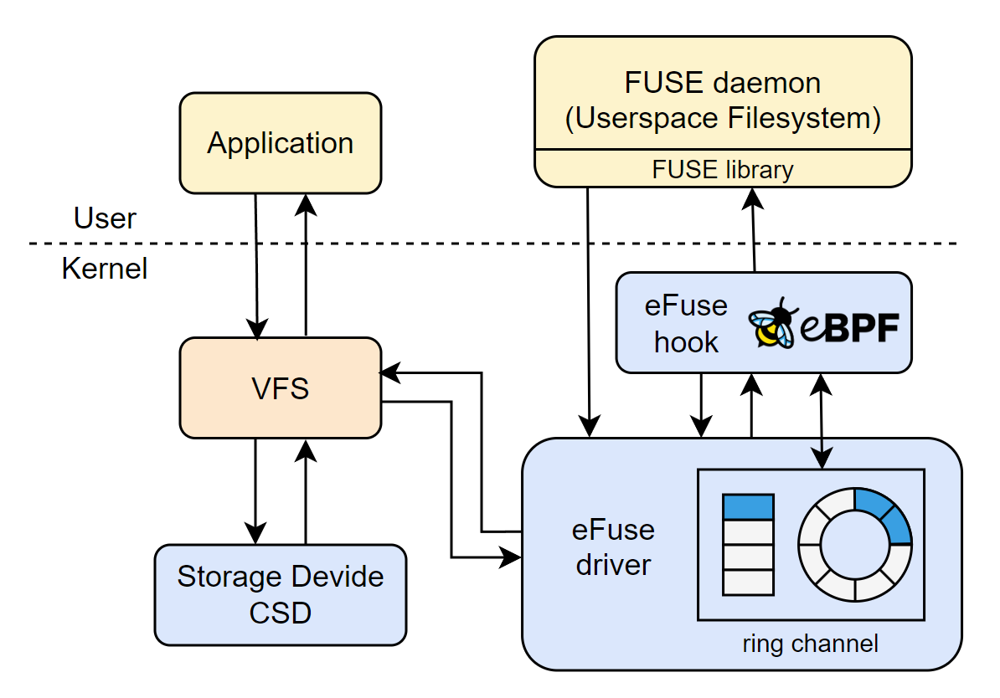

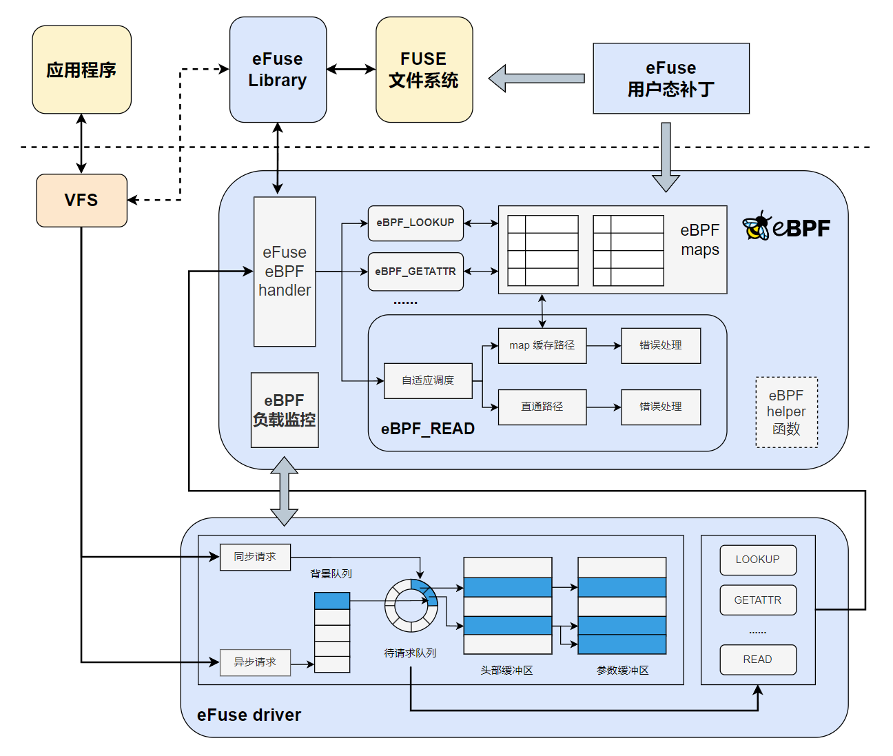

以上两张图展示了 eFuse 的整体架构和工作流程，分别对应以大框架模块为重点的精简结构图和以细节功能实现为重点的完整结构图。

在原始 FUSE 结构的基础上，增加了 eBPF 模块，并对 FUSE 内核驱动进行更改优化，设计 eFuse 内核驱动模块，对 FUSE library (libfuse) 进行部分适配性修改。同时，尝试引入计算存储设备，实现跨主机和设备，管理计算和存储资源的统一 I/O 堆栈。

eFuse 核心设计思想如下：

* 在内核中设置 eBPF 程序挂载点，对部分文件系统操作进行高效处理并直接返回，避免频繁的内核/用户态切换。

* 为每个内核分配一个环形管道 (ring channel) ，以代替原 FUSE 中的共享队列，避免队列锁争用。

* 在 eBPF 程序挂载点中，同时实现对各个核对应的环形管道的负载监控，并依此实现各个内核的负载均衡。

* 创新性地引入目前前沿的存算一体设备，在存储设备具有计算功能的情况下，尝试将部分请求放在设备端处理。

* 保留原 FUSE 的请求流程，当请求不满足条件或 eFuse 出现差错时，退回到原本用户态文件系统，保证系统的完整性。

### 4.3 用户态文件系统绕过模块

该模块主要用于实现对来自应用程序的 FUSE 请求的快速处理，从而实现不需要实际进入用户态文件系统，也可以处理特定请求的功能。通过尝试直接在 eBPF 程序中处理 FUSE 请求并直接返回给应用程序，避免了原始 FUSE 请求流程中频繁的内核/用户态切换，从而提高性能。同时，由于 eBPF 的灵活性，该模块处理各个请求的方式可以灵活定义和设计，具有良好的可扩展性和安全性。

为实现上述功能，首先需要对 FUSE 内核模块进行少量的修改，具体修改内容包括：

1. 添加自定义 eBPF 程序类型，便于后续管理。
2. 在进入用户态文件系统前的位置添加 eBPF 挂载点，触发对应的 eBPF 程序。
3. 设计并注册相关的 helper 函数，便于后续 eBPF 程序的实现。

可以将来自应用程序的常见 FUSE 请求分为 **元数据请求** 和 **I/O 请求** 两类。其中，元数据请求即为涉及inode、目录、权限、路径等文件信息的相关操作，如 LOOKUP、GETATTR 等。I/O 请求即为以 READ、WRITE 为主的，涉及文件具体内容读写的请求。

对 **FUSE 元数据请求** 的绕过处理相对简单，使用 eBPF map 实现元数据内容的缓存，为使用率较高的各种 FUSE 元数据请求设计独立的 eBPF 程序，当 FUSE 内核驱动向用户态文件系统发送请求时，触发相应的 eBPF 程序，通过 eBPF map 中的缓存数据尝试快速处理请求，若完成请求即可直接返回结果并实现用户态文件系统的绕过。同时，需要在内核态（eBPF 程序）和用户态（文件系统）中协调配合，以保证 eBPF map 中数据的正确性和高命中率。

对于各个FUSE请求对应的eBPF函数，主要的功能分为访问map、维护map两类，在初赛阶段我们对如下FUSE元数据请求设计了单独的eBPF函数：

| FUSE 请求 | 操作码 | 说明                                                                                                                  |
| -------- | -------- | --------------------------------------------------------------------------------------------------------------------- |
| LOOKUP  | 1     | 访问 map 并绕过。|
| GETATTR  | 3     | 访问 map 并绕过。|
| SETATTR  | 4     | 维护 map。|
| GETXATTR  | 22     | 访问 map 并绕过。 |
| FLUSH  | 25     | 维护 map 并绕过。|
| RENAME  | 12     | 维护 map。|
| RMDIR  | 11     | 维护 map。 |
| UNLINK  | 10     | 维护 map。 |
| READ  | 15     | 特殊处理，实现绕过。 |
| WRITE  | 16     | 特殊处理，可选绕过。 |

对 **FUSE I/O 请求** 的绕过处理更为复杂。一方面，文件内容的长度不固定且跨度较大，简单的 map 缓存机制不合适。另一方面，对于某些特定的负载场景，如对单一文件的频繁读写、连续对不同文件的读写等，map 的命中率显著降低，出现性能问题。为解决上述情况，我们设计了两条绕过路径：**map 缓存路径** 和 **直通路径**，同时设计 **自适应调度算法**，使系统能够根据先前的工作情况，预测并判断哪条路径更快实现请求，从而使该系统**在各种负载情况下都能实现较高的性能**。

FUSE I/O 请求相关用户态绕过模块的具体设计架构和工作流程如下图所示：

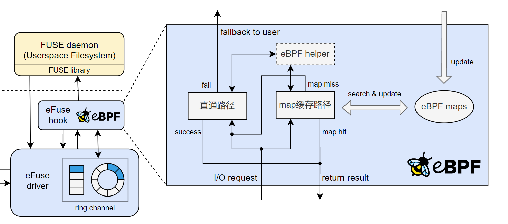

* **map 缓存路径**
  
  该绕过路径需要使用 eBPF map 实现文件数据内容的缓存，在 map 中存储一定长度的文件数据块，并通过多次查找并拼接的方式得到完整的文件数据并返回，对于不在缓存 map 中的数据块，可以独立通过用户态文件系统（或下述直通路径）获取并完成拼接。由于 eBPF 验证器的指针、栈限制，该过程需要设计合适的内核 helper 函数辅助完成。

* **直通路径**

  为解决在某些特定的负载场景下，map 命中率较低导致的性能不佳，提出直通路径。即在 eBPF 程序中直接尝试读取磁盘内容并返回。由于 eBPF 验证器的指针限制，该过程同样需要设计合适的内核 helper 函数辅助完成。同时，上述过程需要严格限制磁盘的访问范围，以保障系统的安全性。

* **自适应调度算法**

  为使系统能够在不同的负载情况下选取合适的绕过路径，设计了**探测+预测型自适应调度算法**。将一定数量的 READ 请求定为一个轮次，在同一轮次的前几次请求中，同时走两条绕过路径并记录所需的平均时间，进行探测，在进行同轮次剩余的请求时，通过先前的探测运行时间、缓存命中率、请求大小等要素，预测计算该请求在两条路径在所需的时间，并以此选择合适的绕过路径。

### 4.4 多核优化模块

#### 4.4.1 优化原理

我们针对现代高性能存储设备和多核硬件环境优化的用户空间文件系统框架，设计更改了 FUSE 的内核驱动模块。它通过以下方式显著提升了性能：

* **可扩展的内核-用户空间通信**：采用每个核心的环形缓冲区结构作为通信通道，确保请求在无锁争用的情况下高效传输，最大化并行性。

*	**高效的请求传输**：通过将环形通道映射为内核和用户空间之间的共享内存，并使用混合轮询机制，有效减少了上下文切换和请求复制的开销。

#### 4.4.2 与原生 FUSE 的区别

原生 FUSE 框架虽然提供了在用户空间中开发文件系统的灵活性，但由于其复杂的软件堆栈，存在显著的性能开销。具体问题包括：

*	单队列设计：FUSE 的所有请求都通过单个队列处理，导致锁争用严重，限制了并行性。

*	频繁的上下文切换：FUSE 在内核和用户空间之间频繁切换，增加了延迟。

*	请求复制开销：FUSE 需要多次复制请求数据，进一步降低了性能。

#### 4.4.3 具体实现

多核优化模块的实现基于环形缓冲区和混合轮询机制，具体实现如下：

* **环形缓冲区**

  eFuse 多核优化模块为每个 CPU 核心分配一个环形缓冲区，用于存储文件系统操作请求。这些环形缓冲区通过共享内存映射到内核和用户空间，减少了数据复制的开销。例如，在 efuse_iqueue_init 函数中初始化了这些环形缓冲区。

  定义了多种环形缓冲区结构，如 struct ring_buffer_1 用于普通请求队列（如挂起队列和完成队列）等，struct ring_buffer_2 用于中断队列，struct ring_buffer_3 用于遗忘队列，以及指向内核地址，用户地址的参数和请求指针（karg,kreq和uarg,ureq），分别用于内核空间和用户空间的访问。

  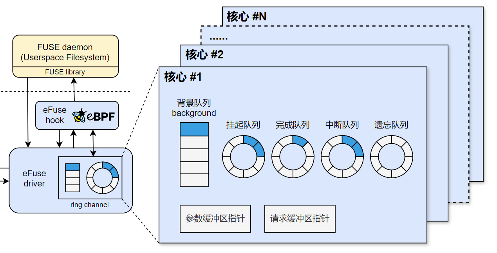

* **混合轮询机制**

  eFUSE 多核优化模块在用户空间中引入了混合轮询机制，允许工作线程在用户定义的周期内进行忙等待，避免了频繁的上下文切换。例如，在用户定义的周期内（默认为 50 微秒），线程可以进行空闲的忙等待，以接收传入的请求或响应。在 efuse_simple_request 函数中，通过判断请求是否为异步以及是否需要等待完成，决定是否使用轮询机制来等待请求的完成。

*	**NUMA 意识**

    eFUSE 多核优化模块考虑了 NUMA 架构，将环形缓冲区分配到与 CPU 核心相同的 NUMA 节点上，减少了跨 NUMA 节点访问的延迟。例如，在 efuse_iqueue_init 函数中，通过 cpu_to_node 确保了内存分配的 NUMA 意识。在 rfuse_iqueue_init 函数中，通过 cpu_to_node(i) 获取每个核心对应的 NUMA 节点，并在该节点上分配内存。这样可以确保内存访问的本地性，减少跨 NUMA 节点访问的延迟。

eFuse 多核优化模块具体操作流程图如下：


#### 4.4.4性能对比提升

通过上述工作，eFuse在多个方面显著提升了在多核负载下文件系统的性能，与原生 FUSE 相比：

*	延迟降低：通过减少上下文切换和请求复制的开销，FUSE 的延迟显著降低。例如，在 efuse_simple_request 函数中，通过混合轮询机制减少了线程唤醒的延迟。

*	吞吐量提升：FUSE 的每个核心环形缓冲区设计提高了并行性，使得在多线程场景下吞吐量显著提升。

*	可扩展性增强：上述设计使得它在多核硬件环境中表现出更好的可扩展性。例如，在随机读取工作负载中，eFuse 的吞吐量随着线程数的增加而持续扩展，而 FUSE 在超过 16 个线程后无法扩展。

### 4.5 设备/内核路径调度模块

#### 4.5.1 模块背景

计算存储设备（Computational Storage Device，CSD）是一类在存储硬件中集成计算能力的新型存储系统架构。与传统存储设备仅提供数据读写功能不同，CSD 能在设备端直接对数据进行预处理或计算，从而减少主机与存储之间的大规模数据传输，降低主机 CPU 占用，并提升整体系统吞吐率。在 CSD 架构下，数据处理既可以在设备端完成，也可以在主机内核端执行，不同路径在延迟、带宽占用和计算开销等方面各有优势。

在初赛阶段，我们构思的优化方案已经覆盖 FUSE 请求处理流程中的绝大多部分，为了进一步探求 FUSE 的性能上限，同时适配现代新型存储系统架构，我们尝试从 I/O 堆栈的层面对 FUSE 性能作进一步优化。在当前系统存在相关 CSD 存储设备的情况下，在调度算法的帮助下，eFuse 会尝试将部分计算需求转移到设备端而非原本的内核路径。

在具体应用场景中，设备端与内核端处理路径的选择需要根据数据规模、计算复杂度、I/O 模式等多种因素动态调整。固定路径的处理模式往往难以兼顾延迟和吞吐性能，甚至可能在某些场景下造成性能退化。因此，需要引入路径调度机制，根据实时运行状况和任务特征，将请求合理分配到设备端或内核端执行，从而在性能与资源利用率之间取得平衡。

#### 4.5.2 模块设计目标

在当前 eFuse 项目中，我们决定使用仿真实现 CSD 存储设备，在在仿真 CSD 系统中，根据任务特征与系统运行状态，动态选择最优的数据处理路径，实现以下目标：

- 性能最优化

  在保证数据处理正确性的前提下，充分利用设备端的并行计算能力与内核端的灵活性，降低数据传输延迟，提高整体吞吐率。

- 资源高效利用

  根据实时的 CPU、I/O 和设备端计算资源负载情况，合理分配任务，避免单一端资源过载或闲置。

- 适应多场景工作负载

  针对不同类型的请求（如小文件随机访问、大文件顺序处理、计算密集型操作等）自动调整路径选择策略，保证在多样化负载下的稳定性能表现。

- 可扩展性与可维护性

  模块设计保持接口清晰、实现可扩展，以便后续在仿真环境中引入更多路径选择策略或与实际硬件对接。

#### 4.5.3 具体实现

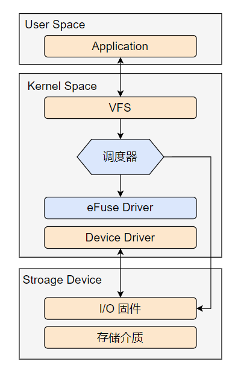

- 执行路径机制

设备端执行路径：请求被直接发送至仿真 CSD 的设备端计算模块，由其完成数据处理和结果生成，并返回给主机端。

内核端执行路径：即原本的 FUSE 逻辑，进入 eFuse Driver，由主机内核端的处理模块执行。

- 路径判定逻辑

在调度器接收到上层传递的 I/O 请求后，首先解析请求的关键信息，包括数据块大小、请求类型（读/写/计算）等信息。结合存储的先前的几次相同操作的运行时长，估计得到设备端存储时延、设备端计算时延、内核段执行时延，通过比较内核段时延和设备端存储时延+计算时延的大小，决定该请求应在设备端还是内核端执行。

## 五、性能测试与评估

### 5.1 虚拟机初步测试

#### 5.1.1 虚拟机初步测试介绍

该测试为文件系统设计并模拟实际使用场景下常见的负载场景，考虑到虚拟机中的测试环境可能无法完全发挥存储设备的潜力，故该部分主要通过与其他相关文件系统对比，来评估 **用户态文件系统绕过模块**、**多核优化模块**、**设备/内核路径调度模块** 等主要模块在 FUSE 读写场景中的性能优化效果。

为全面评估 eFuse 的优化效果，我们设计了三类典型的负载场景：

* **负载测试1**： 单个文件的小块随机读取
* **负载测试2**： 多个小文件的随机读写混合操作
* **负载测试3**： 多个大文件的分散式随机读写

以上三组测试可以分别代表数据库、网页服务器、多媒体应用等多种实际场景，量化评估 eFuse 在不同类型负载下的 IOPS、吞吐量、延迟等性能指标。

在上述三组场景中进行文件的随机读写操作（读写比 7:3），模拟文件系统实际使用场景下的性能。

本测试以 **原始 FUSE** 、 **其他相关项目 ExtFUSE** 、**内核态文件系统EXT4** 以及我们**初赛阶段的eFuse**测试结果 作为性能参照，性能测试基于简易用户态文件系统 StackFS。

其中，**ExtFUSE** 为与本项目类似的相关开源项目，同样旨在利用 eBPF 对 FUSE 的性能做优化，我们尝试对其进行复现，测试结果如下所示。

#### 5.1.2 虚拟机测试环境

| 项目    | 配置说明  |
|----------------|----------------------|
| 虚拟平台       | VMware Workstation     |
| 操作系统       | Ubuntu 22.04 LTS（64 位） |
| 内核版本       | Linux 6.5.0（自定义修改）   |
| 分配 CPU       | 12 核心（虚拟）   |
| 分配内存       | 8 GB         |
| 虚拟磁盘       | 100 GB SCSI 虚拟磁盘（存储于宿主机 NVMe SSD 上） |


#### 5.1.3 测试结果

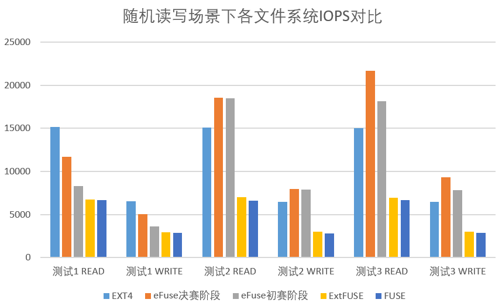
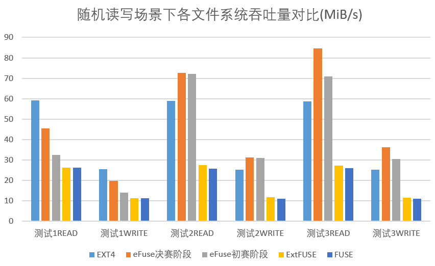
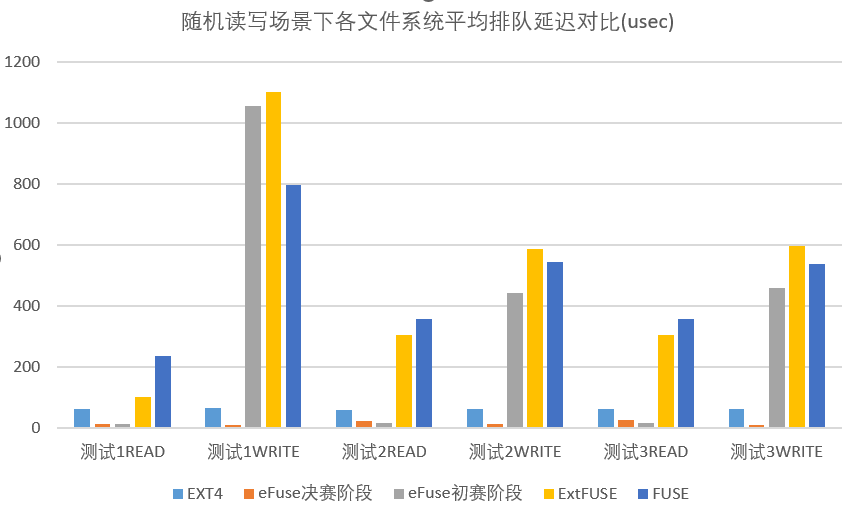
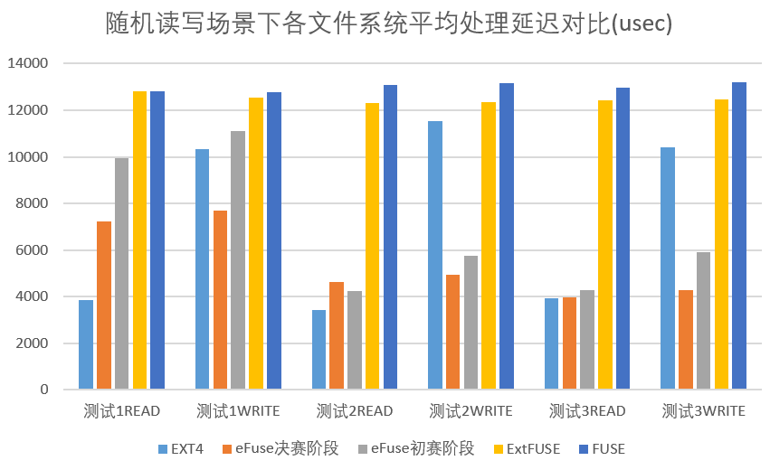

#### 5.1.4 测试结果分析

从测试结果可以可以看到，在三种负载测试下，eFuse 在读写性能上相比传统的 FUSE 和改进版 ExtFUSE 均取得了大幅提升，验证了基于 eBPF 各项优化路径设计的有效性。

- 在 **负载测试2：多个小文件的随机读写混合测试** 和 **负载测试3：多个大文件的分散式随机读写** 中，eFuse 能够充分发挥出了 eBPF 缓存的优势，极高地提升了 IOPS 和吞吐量。尤其是针对多个小文件场景，元数据和小块 I/O 请求频繁，传统 FUSE 架构因为过渡于频繁的 用户态/内核态 切换而成为性能瓶颈，而 eFuse 通过 eBPF 路径极大降低了这种开销，在这种负载类型下性能大幅跃升，**读写性能相比原始 FUSE 能够提升约3到4倍**，在 eBPF map 缓存路径的帮助下，**性能甚至超过了内核文件系统 EXT4**。

- 在 **负载测试1：单个文件的小块随机读取** 中，面对单个文件中的较大数据块的随机访问，eFuse 依然有优秀表现，虽然 eBPF map 缓存命中率下降，但依旧可以通过直通路径加速处理请求的速度，显示出 eFuse 在各种场景下都能基本维持较高的性能水平，**读写性能相比原始 FUSE 能够提升约1.5到2倍**。

- 在 **多核优化模块** 的影响下，可以看到**在三个测试环境下读写的平均排队延迟都显著下降**，由于我们在虚拟机中进行的初步测试负载的测试压力并不算大，平均排队延迟甚至能够逼近0，能够看出该优化方向在大压力负载下的巨大潜力。

需要特别指出的是，由于需要维护 eBPF map 的正确性，在某些较极端的测试场景下（比如以写操作为主的测试场景），请求的平均延迟相比 FUSE 可能还会略有上升，但从综合性能和常见的负载常见来看，附加的维护成本完全被更快速的读操作和更低的总体延迟所抵消，维护 eBPF map 的性能代价是值得的，最终能够取得更佳的效果。

同时，我们记录各个系统在测试过程中的 **内核态/用户态切换次数**，以 **负载测试1：单个文件的小块随机读取** 为例，可以明显看出 **用户态文件系统绕过模块** 的工作效果，具体数据如下：

| 文件系统 | 切换次数  | 说明 |
| -------- | -------- | ----|
| __FUSE__  | 169664 | 基线 |
| __ExtFUSE__  | 105581 | 相比 FUSE 降低约38% | 
| __eFuse__  | 78476 | 相比 FUSE 降低约54% |

**ExtFUSE** 主要针对 **FUSE** 中的部分元数据请求做绕过处理，实现了 **内核态/用户态切换次数** 一定程度的下降。而 **eFuse** 对更多的元数据请求做了进一步优化处理，同时为更为复杂的 I/O 请求做特殊处理，进一步降低了 **内核态/用户态切换次数**，从而实现性能大幅优化的效果，符合预期。

在多个负载测试下，eFuse 的性能都逼近 EXT4。在 **负载测试2：多个小文件的随机读写混合测试** 下，eFuse 表现优异，由于能够充分发挥 eBPF map 缓存路径的优势，性能一度超越 EXT4，**显示出了 eFuse 在小文件场景的极强竞争力**。

| 性能指标 | __eFuse__  | __EXT4__ |
| -------- | -------- | ----|
| __READ IOPS__  | 18456 | 15122 |
| __WRITE IOPS__  | 7931 | 6481 | 
| __READ 吞吐__  | 72.1M | 58.9M |
| __WRITE 吞吐__  | 31.0M | 25.3M |

总体而言，通过虚拟机初步测试可以看到 eFuse 在多个负载场景下显示出了极强的性能优势：

- 在小文件和混合负载场景下，IOPS 能够增幅约 3–4 倍。
- 吞吐量相比 FUSE 增长 1.5–4 倍。
- 平均排队延迟大幅下降，有效解决了 FUSE 请求队列拥塞问题。
- 平均处理延迟有显著降低，响应更快，更稳定。
- 内核态/用户态切换次数降低约50%，节省开销。
- 在多文件情况下，性能接近甚至略超标准 EXT4 文件系统，显示出极大潜力。

最终，eFuse 在针对 FUSE 文件系统性能瓶颈进行了精准优化后，不仅提升了性能，更大大扩展了 FUSE 在各种负载场景下的适用性。

具体测试结果见：[fio 综合测试结果](./fio_test)

### 5.2 物理机综合测试

#### 5.2.1 物理机综合测试介绍

我们在物理机中部署了等价的运行环境，在其中进行负载压力更大的相关测试，为了获得更为真实准确的测试结果。

我们同样设计了三类典型的负载场景，具体参数指标如下：

| 参数指标 | __测试1__  | __测试2__ | __测试3__ |
| -------- | -------- | ----| ----- |
| __模拟场景__  | 单文件随机读写 | 小文件随机读写 | 大文件随机读写 |
| __读写比例__  | 7:3 | 7:3 | 7:3 |
| __访问模式__  | 随机读写 | 随机读写 | 随机读写 |
| __读写块大小__  | 4K | 4K | 1M (eFuse测试组为512K) |
| __读写总大小__  | 8M | 100M | 20G |
| __文件数/大小__  | 单文件 | 50个文件，每个512K | 5个文件，每个2G |
| __任务数__  | 8 | 16 | 16 |
| __队列深度__  | 256 | 256 | 64 |
| __运行时间__  | 60s | 60s | 120s |

**存储设备采用 NVMe 固态硬盘，容量为 512GB，型号为 Hyundai 512G NVMe SSD。**

需要特殊说明的是，由于 eBPF map 内能够存放的数据的大小限制，在 **测试3** 中，无法完成单次请求数据块大小为1M的操作，实际单次读写的数据块为512K，对后续测试结果可能有一定的负面影响，我们考虑在之后进一步解决 eFuse 无法单次处理大数据块的问题。

#### 5.2.2 测试结果

部分测试结果图由于数据跨度较大，纵坐标采用对数刻度。

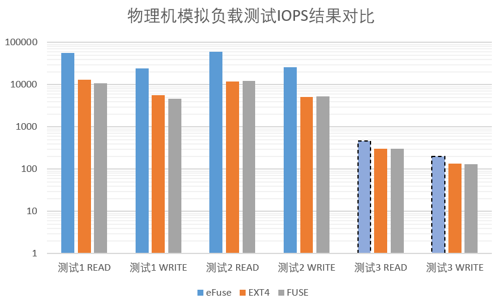
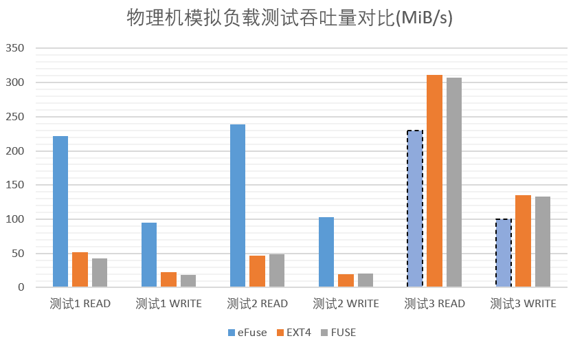
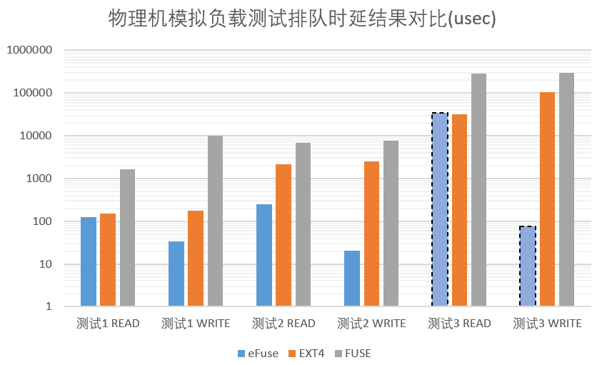
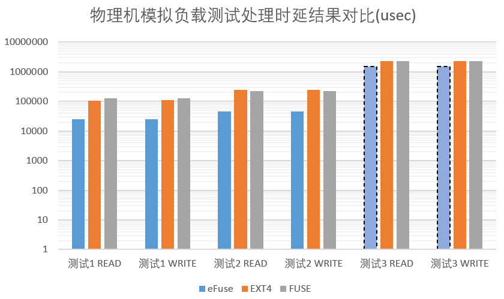

#### 5.2.3 测试结果分析

在物理机测试环境下，进行了负载压力更大的性能测试，eFuse 在各个测试场景下的读写性能相较原版 FUSE 都有了大幅提升，基本完全超越内核态文件系统 EXT4。

- 除去单次读写的数据块大小出现异常的 **测试3** 外，**测试1**和 **测试2** 的读写单位都为小数据块（4K），IOPS 、读写吞吐量、读写操作的处理时延都能够实现远超原版 FUSE 的性能，提升约 4~5 倍，充分发挥了 **eBPF map 缓存路径** 和 **CSD 存算一体设备路径** 的优势。

- 对于读写单位为大数据块的测试场景，原本 FUSE 的吞吐量本身达到了较高水平，而 eFuse 一方面无法一次存入大数据块至 eBPF map 中，另一方面需要在 eBPF 程序中进行多次数据拼接，导致总体性能有所下降。优化在大数据块场景下的读写性能将成为 eFuse 在之后的优化方向和挑战。

- 在较大压力的测试场景下，**测试1** 和 **测试2** 的读写操作的排队时延大幅下降，相较原版 FUSE 下降约几十到几百倍不等，充分展现了 **多核优化模块** 和 **负载监控和调度** 在压力测试下的优化效果，**充分缓解了原版 FUSE 请求堆积的问题**。

具体测试结果见：[fio 综合测试结果](./fio_test)

## 六、项目开发文档和演示PPT

[eFUSE初赛设计开发文档](./eFUSE初赛设计开发文档.pdf)

[eFuse PPT](./eFuse.pptx)

## 七、快速启动和功能展示

**注：gif可能需要一段时间加载**


## 八、目录索引

```shell
.
├── efuse # 主要项目代码
│   ├── bpftool # eBPF辅助工具
│   ├── libbpf # eBPF库，提供接口
│   ├── patch # FUSE及eBPF相关补丁
│   ├── vmlinux # 用于eBPF编译和验证
│   ├── efuse.bpf.c # eBPF程序主题代码
│   ├── Makefile # eFuse构建脚本
│   └── others
├── Stackfs # 用于测试的用户态堆叠文件系统（github软链接）
│   ├── StackFS_LL.c # StackFS主体代码
│   ├── Makefile # StackFS构建脚本
│   ├── others
│   └── tmp # 用于挂载和测试StackFS的临时目录
│       └── to # 可挂载并实际操作的目标子目录
├── linux # 修改后的内核，加入eFUSE支持和相应修改（github软链接）
├── linux_modified # 内核中进行过修改的文件整理
├── libfuse # FUSE库（github软链接）
├── fio_test # 性能测试结果
├── README.md
├── doc # 比赛过程中的记录文件
├── eFUSE初赛设计开发文档.pdf
├── eFuse.pptx
├── eFuse演示视频.mp4
└── images
```

## 九、致谢

* 感谢 [libbpf](https://github.com/libbpf/libbpf)、[libfuse](https://github.com/libfuse/libfuse) 等优秀开源项目
