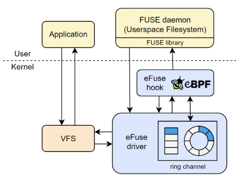
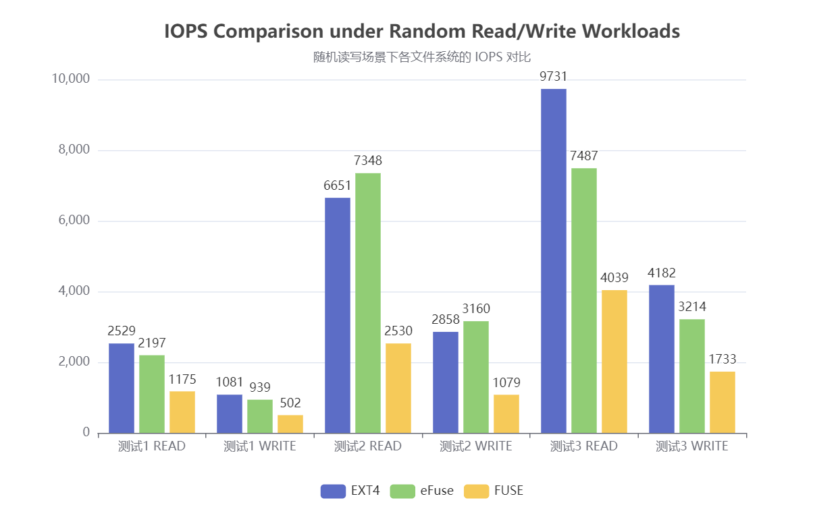
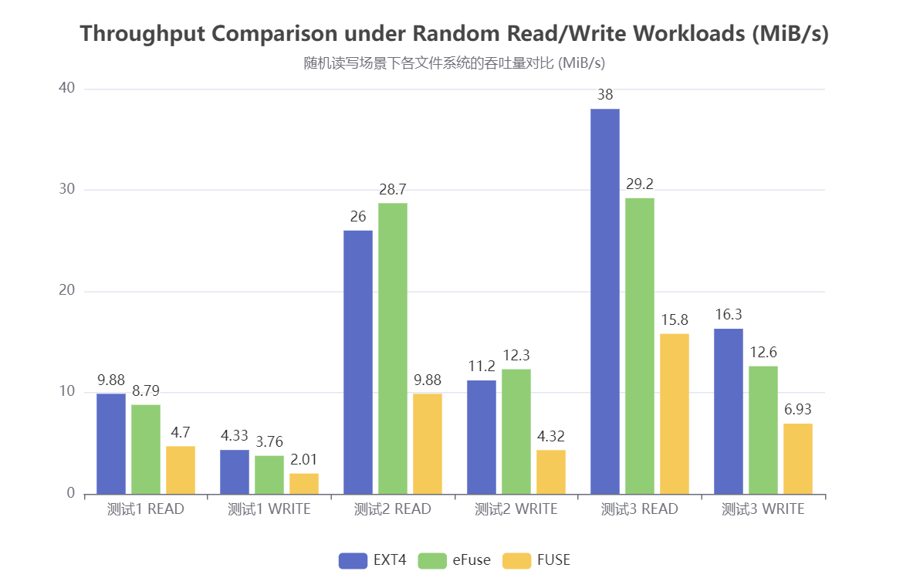
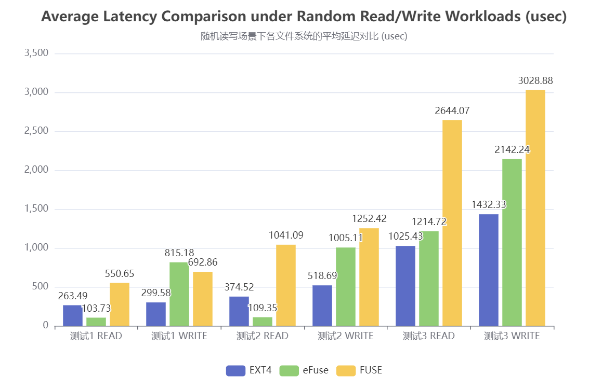

# eFuse-基于eBPF加速的高性能用户态文件系统

## 目录

- [一、基本信息](#一基本信息)
- [二、项目概述](#二项目概述)
  - [2.1 背景和意义](#21-背景和意义)
  - [2.2 关于 eFUSE](#22-关于efuse)
- [三、项目目标与规划](#三项目目标与规划)
  - [3.1 项目目标](#31-项目目标)
  - [3.2 初赛内容](#32-初赛内容)
  - [3.2 完成情况](#33-完成情况)
- [四、项目架构和设计方案](#四项目架构和设计方案)
  - [4.1 原始FUSE结构分析](#41-原始FUSE结构分析)
  - [4.2 eFuse架构设计](#42-eFuse架构设计)
  - [4.3 用户态文件系统绕过模块](#43-用户态文件系统绕过模块)
  - [4.4 多核优化模块](#44-多核优化模块)
- [五、性能测试与评估](#五性能测试与评估)
  - [5.1 单线程测试](#51-单线程测试)
  - [5.2 多核负载测试](#52-多核负载测试)
- [六、功能展示](#六功能展示)
- [七、目录索引](#七目录索引)
- [八、致谢](#八致谢)

## 一、基本信息

| 赛题 | [proj289 基于内核态/用户态 eBPF 实现高性能用户态文件系统功能](https://github.com/oscomp/proj289-High-performance-user-mode-file-system) |
| :-: | :-: |
| **队伍名称** | FastPoke |
| **项目名称** | eFuse |
| **小组成员** | 许辰涛、冯可逸、赵胜杰 |
| **项目导师** | 郑昱笙 |
| **校内导师** | 夏文、李诗逸 |

## 二、项目概述

### 2.1 背景和意义

FUSE（Filesystem in Userspace）是一种允许在用户态构建文件系统的linux机制，使开发者能够在不必修改内核源码的条件下，便捷且灵活地开发自定义文件系统，极大地降低了开发门槛，简化了开发流程，提高了内核安全性。然而，FUSE 的性能瓶颈一直备受诟病，尤其在高频繁元数据操作、大量小文件读写等场景下，**内核态与用户态频繁切换成为主要性能瓶颈**，限制了其在特定的高性能场景下的适用性。

在 FUSE 内部的实现中，来自 VFS (虚拟文件系统) 层的所有请求都被放入共享的待处理队列 (pending queue) 中，并由 FUSE 守护进程逐个提取。这种调度方式**在某些高并发的场景下会导致严重的锁争用**。在多核环境下，无法充分发挥多核处理器的并行优势，使得系统在面对大规模的I/O任务时吞吐率首先，处理时延较高，无法充分利用带宽的潜力。

eBPF（extended Berkeley Packet Filter）是 Linux 的一项强大特性，允许开发者在不修改内核源码的情况下向内核注入用户定义逻辑，已广泛应用于网络、安全、追踪等领域，eBPF 为解决和优化上述 FUSE 的性能问题提供了新的可能和方向。近年来，已有多项研究探索将 eBPF 引入文件系统以提升其性能，例如 ExtFuse、Fuse-BPF、XRP 等。我们期望通过本项目，进一步探索基于 eBPF 的 FUSE 加速路径，**实现低延迟、高吞吐、具有良好扩展性的用户态文件系统**。

### 2.2 关于eFUSE

eFuse 是一个尝试将 eBPF 深度集成到 FUSE 文件系统中的创新项目，旨在重构 FUSE 的传统执行路径和请求调度方式，以提高用户态文件系统的运行效率，同时保留 FUSE 的灵活性和安全性的优势。借助 eBPF 这一灵活的特性，对特定的文件系统进行性能优化，实现以下三大目标：
- **减少内核态与用户态之间的频繁切换**

  在内核中直接处理部分 FUSE 请求（如 LOOKUP、READ 等），避免传统 FUSE 工作流程中频繁的内核/用户态切换，提高请求处理效率。

- **设计高效的 I/O 和元数据缓存机制**

  利用 eBPF 的 map 数据结构实现元数据和读写数据的缓存机制，降低磁盘的访问频率。

- **实现跨核高并发优化与负载均衡机制**

  针对 FUSE 共享请求队列带来的并发限制，设计更为合理、更适合多核的请求调度方式，并结合 eBPF 进行负载监控，避免锁的集中争用。 

相比传统 FUSE 和相关研究，eFuse 具有如下优势：

* 保留传统 FUSE 的灵活性和可移植性
* 避免对内核的大范围改动，对用户友好
* 用户可为不同的 FUSE 请求动态注册钩子函数，具有强大的可编程性
* 完全兼容现有的 FUSE 应用
* 高性能，能够充分发挥带宽能力，适用于各种负载场景
* 适配多核 CPU 的现代硬件环境
* 可动态制定 FUSE 请求的拥塞调度策略，灵活性高
* 安全性保障完善

## 三、项目目标与规划

### 3.1 项目目标
为实现上述目标，进一步将本项目分为五大技术目标模块，完成情况如下：

| 实现内容                                               | 完成情况 | 说明                                                                                                                                                                                                  |
| ------------------------------------------------------ | -------- | ----------------------------------------------------------------------------------------------------------------------------------------------------------------------------------------------------- |
| **目标1：FUSE 内核模块扩展** | 全部完成 | 1. 支持新的eBPF程序类型。  2. 扩展FUSE挂载点支持。   3. 设计并注册文件系统相关 helper 函数。 |
| **目标2：FUSE 元数据请求优化** | 全部完成 | 1. 优化 inode、目录、权限、路径等相关操作。（如 LOOKUP、GETATTR） 2. 使用 eBPF map 实现元数据缓存。  3. 实现内核态与用户态高效协调访问。 4. 内核/用户态切换次数显著下降。 |
| **目标3：FUSE I/O 请求的特殊优化** | 全部完成 | 1. 支持直通路径：eBPF 直接读取文件内容。  2. 支持缓存路径：将内容存入 eBPF map 缓存。  3. 设计请求调度策略实现直通与缓存路径选择。 4. 读写性能提升 1.5~3 倍。 |
| **目标4：基于内核修改的多核优化**  | 进行中 | 1. 为每个核心构建独立 ringbuf 管道代替请求队列。  2. 实现可扩展的核间通信机制。  3. 实现多核 CPU 环境的适配。 |
| **目标5：负载监控与请求均衡**   | 进行中 | 1. 利用 eBPF 动态分析请求负载。 2. 根据 ringbuf 状态进行调度策略调整。 3. 针对不同的负载情况实现合理的请求分配。 |

### 3.2 初赛内容

我们将上述目标拆分为以下若干行动项：

- [X] 行动项 1：进行背景知识调研，了解 FUSE 的核心性能瓶颈。
- [X] 行动项 2：搭建开发环境。
- [X] 行动项 3：FUSE 内核驱动扩展、加载 eBPF 程序、设置挂载点入口。
- [X] 行动项 4：实现并注册内核 eBPF helper 辅助函数。
- [X] 行动项 5：实现 FUSE 元数据请求绕过路径和回退机制。
- [X] 行动项 6：在用户态和内核中协调访问。
- [X] 行动项 7：实现 FUSE I/O 请求 map 缓存绕过路径。
- [X] 行动项 8：实现 FUSE I/O 请求直通绕过路径。
- [X] 行动项 9：实现 FUSE I/O 请求中的自适应调度算法。
- [X] 行动项10：FUSE 请求绕过机制的安全性评估和处理。
- [ ] 行动项11：为 FUSE 内核设计更为合理的请求队列数据结构。
- [ ] 行动项12：通过 eBPF 实现对请求队列的负载监控和请求均衡。
- [ ] 行动项13：模拟常见的负载场景并进行性能评估。

### 3.3 完成情况

针对上述行动项的完成情况如下：

| 实现内容 | 完成情况 | 说明                                                                                                                  |
| -------- | -------- | --------------------------------------------------------------------------------------------------------------------- |
| 行动项1  | 完成     | 讨论并选定可行的 FUSE 优化方向。|
| 行动项2  | 完成     | 在虚拟机中搭建测试环境，基于 linux 6.5 开发。|
| 行动项3  | 完成     | 使指定文件系统在挂载时自动加载 eBPF 程序，完成eBPF程序在送往用户态文件系统时的自动触发。|
| 行动项4  | 完成     | 在内核中设计并注册合适的 eBPF helper 函数，便于后续开发，同时须确保 eBPF 程序安全性。 |
| 行动项5  | 完成     | 实现 LOOUP、GETATTR 等元数据请求的绕过机制，大幅降低文件系统在运行时的内核态/用户态切换次数。|
| 行动项6  | 完成     | 对指定的用户态文件系统做一定的修改，使其与 eBPF 程序协调配合，管理 eBPF map 中的数据内容。|
| 行动项7  | 完成     | 实现以 READ、WRITE 为主的文件 I/O 请求的 eBPF map 缓存机制，加快请求的处理速度。 |
| 行动项8  | 完成     | 实现以 READ、WRITE 为主的文件 I/O 请求的 eBPF 直通路径，作为对缓存机制的补充。 |
| 行动项9  | 完成     | 设计并实现自适应路径选择算法，使系统在不同的负载情况下预测并选择较优的路径，读写性能提升 1.5~3 倍。 |
| 行动项10  | 完成     | 对完成的请求绕过机制进行安全性检查，防止文件读取越界等情况发生，进行处理和优化。 |
| 行动项11  | 进行中     |   |
| 行动项12  | 进行中     |   |
| 行动项13  | 进行中     |   |

## 四、项目架构和设计方案

### 4.1 原始FUSE结构分析

在原始 FUSE 架构中，在应用程序发出系统调用后，首先由内核中的 VFS (Virtual File Syatem) 捕获，并发送至 FUSE 内核驱动，将其放入待处理队列中。队列中的请求依次提交给用户态文件系统处理，将处理完的结果返回内核，最终交付给应用程序。

该框架存在明显的性能瓶颈：

- 频繁的内核态和用户态切换

- 共享队列造成的锁争用

- 缺乏并行和本地缓存机制

### 4.2 eFUSE架构设计

上图展示了 eFuse 的整体架构和工作流程，在原始 FUSE 结构的基础上，增加了 eBPF 模块，并对 FUSE 内核驱动进行更改优化，设计 eFuse 内核驱动模块。其核心设计思想如下：

* 在内核中设置 eBPF 程序挂载点，对部分文件系统操作进行高效处理并直接返回，避免频繁的内核/用户态切换。

* 为每个内核分配一个环形管道 (ring channel) ，以代替原 FUSE 中的共享队列，避免队列锁争用。

* 在 eBPF 程序挂载点中，同时实现对各个核对应的环形管道的负载监控，并依此实现各个内核的负载均衡。

* 保留原 FUSE 的请求流程，当请求不满足条件或 eFuse 出现差错时，退回到原本用户态文件系统，保证系统的完整性。

### 4.3 用户态文件系统绕过模块

该模块主要用于实现对来自应用程序的 FUSE 请求的快速处理，从而实现不需要实际进入用户态文件系统，也可以处理特定请求的功能。通过尝试直接在 eBPF 程序中处理 FUSE 请求并直接返回给应用程序，避免了原始 FUSE 请求流程中频繁的内核/用户态切换，从而提高性能。同时，由于 eBPF 的灵活性，该模块处理各个请求的方式可以灵活定义和设计，具有良好的可扩展性和安全性。

为实现上述功能，首先需要对 FUSE 内核模块进行少量的修改，具体修改内容包括：

1. 添加自定义 eBPF 程序类型，便于后续管理。
2. 在进入用户态文件系统前的位置添加 eBPF 挂载点，触发对应的 eBPF 程序。
3. 设计并注册相关的 helper 函数，便于后续 eBPF 程序的实现。

可以将来自应用程序的常见 FUSE 请求分为 **元数据请求** 和 **I/O 请求** 两类。其中，元数据请求即为涉及inode、目录、权限、路径等文件信息的相关操作，如 LOOKUP、GETATTR 等。I/O 请求即为以 READ、WRITE 为主的，涉及文件具体内容读写的请求。

对 **FUSE 元数据请求** 的绕过处理相对简单，使用 eBPF map 实现元数据内容的缓存，为使用率较高的各种 FUSE 元数据请求设计独立的 eBPF 程序，当 FUSE 内核驱动向用户态文件系统发送请求时，触发相应的 eBPF 程序，通过 eBPF map 中的缓存数据尝试快速处理请求，若完成请求即可直接返回结果并实现用户态文件系统的绕过。同时，需要在内核态（eBPF 程序）和用户态（文件系统）中协调配合，以保证 eBPF map 中数据的正确性和高命中率。

对 **FUSE I/O 请求** 的绕过处理更为复杂。一方面，文件内容的长度不固定且跨度较大，简单的 map 缓存机制不合适。另一方面，对于某些特定的负载场景，如对单一文件的频繁读写、连续对不同文件的读写等，map 的命中率显著降低，出现性能问题。为解决上述情况，我们设计了两条绕过路径：**map 缓存路径** 和 **直通路径**，同时设计 **自适应调度算法**，使系统能够根据先前的工作情况，预测并判断哪条路径更快实现请求，从而使该系统**在各种负载情况下都能实现较高的性能**。

FUSE I/O 请求相关用户态绕过模块的具体设计架构和工作流程如下图所示：

* **map 缓存路径**
  
  该绕过路径需要使用 eBPF map 实现文件数据内容的缓存，在 map 中存储一定长度的文件数据块，并通过多次查找并拼接的方式得到完整的文件数据并返回，对于不在缓存 map 中的数据块，可以独立通过用户态文件系统（或下述直通路径）获取并完成拼接。由于 eBPF 验证器的指针、栈限制，该过程需要设计合适的内核 helper 函数辅助完成。

* **直通路径**

  为解决在某些特定的负载场景下，map 命中率较低导致的性能不佳，提出直通路径。即在 eBPF 程序中直接尝试读取磁盘内容并返回。由于 eBPF 验证器的指针限制，该过程同样需要设计合适的内核 helper 函数辅助完成。同时，上述过程需要严格限制磁盘的访问范围，以保障系统的安全性。

* **自适应调度算法**

  为使系统能够在不同的负载情况下选取合适的绕过路径，设计了**探测+预测型自适应调度算法**。将一定数量的 READ 请求定为一个轮次，在同一轮次的前几次请求中，同时走两条绕过路径并记录所需的平均时间，进行探测，在进行同轮次剩余的请求时，通过先前的探测运行时间、缓存命中率、请求大小等要素，预测计算该请求在两条路径在所需的时间，并以此选择合适的绕过路径。

### 4.4 多核优化模块

TODO

## 五、性能测试与评估

### 5.1 单线程测试

#### 5.1.1 单线程测试介绍

**单线程测试** 限定单个 CPU 核进行性能测试，主要用来评估 **用户态文件系统绕过模块** 的性能优化效果。

为全面评估 eFuse 的优化效果，我们设计了三类典型的负载场景：

* **负载测试1**： 单个文件的小块随机读取
* **负载测试2**： 多个小文件的随机读写混合操作
* **负载测试3**： 多个大文件的分散式随机读写

以上三组测试可以分别代表数据库、网页服务器、多媒体应用等多种实际场景，量化评估 eFuse 在不同类型负载下的 IOPS、吞吐量、延迟等性能指标。

本测试以 **原始 FUSE** 和 **内核文件系统 EXT4** 作为性能参照，其中 FUSE 和 eFUSE 性能测试基于简易用户态文件系统 StackFS。

#### 5.1.2 单线程测试结果

#### 5.1.3 单线程测试结果分析

从测试结果可以可以看到，在三种负载测试下，eFuse 的读写性能都明显优于原始 FUSE，接近内核态文件系统 EXT4。

其中，在 **负载测试2：多个小文件的随机读写混合测试** 中，该测试用例能够充分发挥 eBPF map 缓存路径的优势，其吞吐量和 IOPS 显著增加，与预期相符。在 **负载测试1：单个文件的小块随机读取** 和 **负载测试3：多个大文件的分散式随机读写** 中，面对较大数据块的随机访问，eFuse 依然有优秀表现，虽然 eBPF map 缓存命中率下降，但依旧可以通过直通路径加速处理请求的速度。需要注意的是，由于需要维护 eBPF map 的正确性，在 测试1 下写操作的平均延迟相比 FUSE 略有上升，但是从吞吐率上看这是完全值得的。

整体来看，eFuse 在多种负载测试下的读写 IOPS 相比 FUSE 提升 1.5~3 倍，逼近甚至超越 EXT4，尤其在小文件的场景下更具优势。吞吐量提升 1.5~2 倍，能够更好地发挥设备带宽能力。平均延迟显著降低，响应更快，抖动更小。

### 5.2 多核负载测试

## 六、功能展示

视频链接（TODO）

## 七、目录索引

TODO

## 八、致谢

* 感谢 [libbpf](https://github.com/libbpf/libbpf)、[libfuse](https://github.com/libfuse/libfuse) 等优秀开源项目
