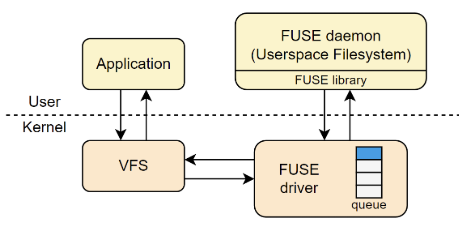
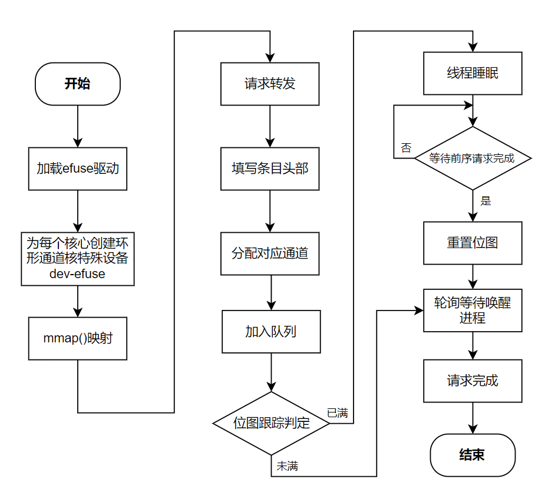
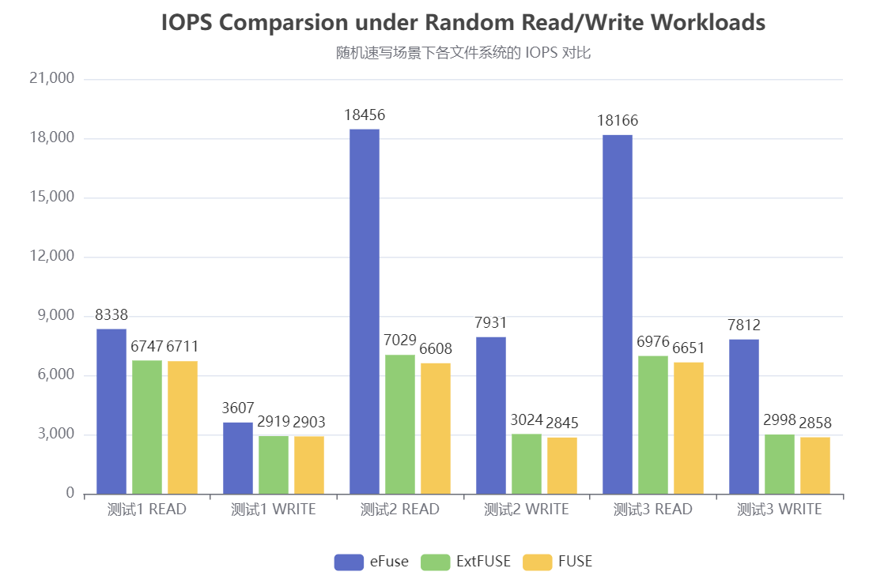
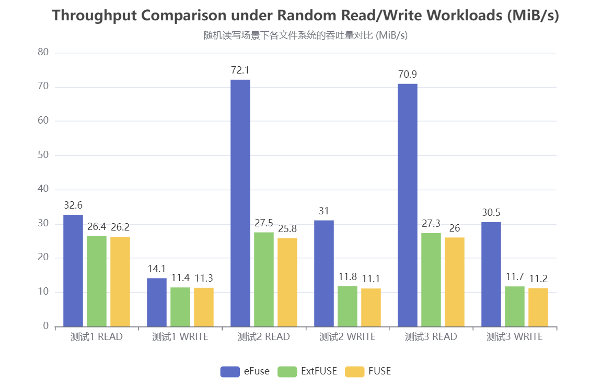
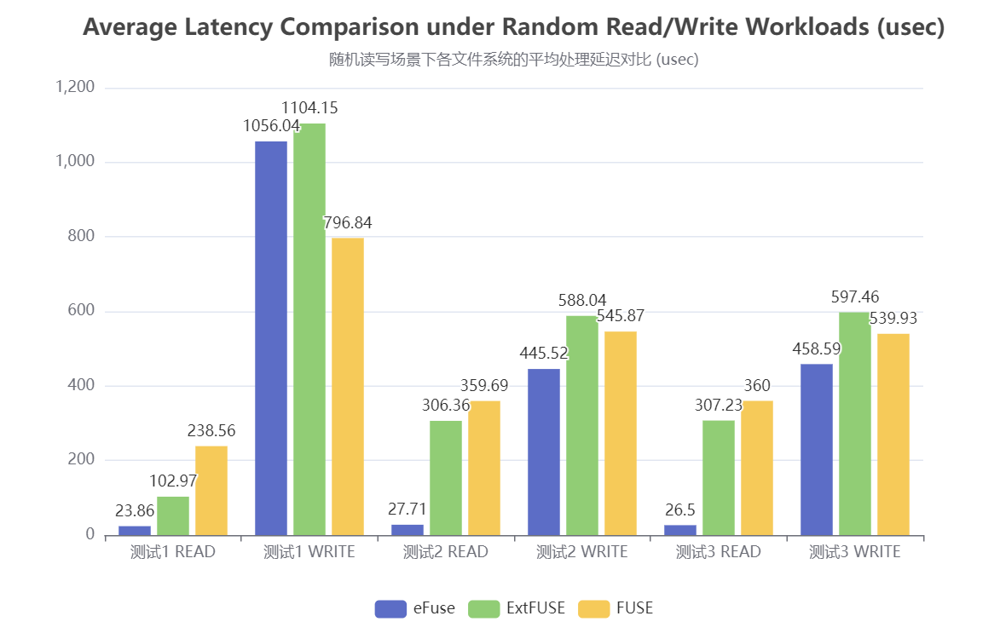

# eFuse-基于eBPF加速的高性能用户态文件系统

## 目录

- [一、基本信息](#一基本信息)
- [二、项目概述](#二项目概述)
  - [2.1 背景和意义](#21-背景和意义)
  - [2.2 关于 eFUSE](#22-关于efuse)
- [三、项目目标与规划](#三项目目标与规划)
  - [3.1 项目目标](#31-项目目标)
  - [3.2 初赛内容](#32-初赛内容)
  - [3.2 完成情况](#33-完成情况)
- [四、项目架构和设计方案](#四项目架构和设计方案)
  - [4.1 原始FUSE结构分析](#41-原始FUSE结构分析)
  - [4.2 eFuse架构设计](#42-eFuse架构设计)
  - [4.3 用户态文件系统绕过模块](#43-用户态文件系统绕过模块)
  - [4.4 多核优化模块](#44-多核优化模块)
- [五、性能测试与评估](#五性能测试与评估)
  - [5.1 综合测试](#51-综合测试)
- [六、项目开发文档](#六项目开发文档)
- [七、目录索引](#七目录索引)
- [八、致谢](#八致谢)


## 一、基本信息

| 赛题 | [proj289 基于内核态/用户态 eBPF 实现高性能用户态文件系统功能](https://github.com/oscomp/proj289-High-performance-user-mode-file-system) |
| :-: | :-: |
| **队伍名称** | FastPoke |
| **项目名称** | eFuse |
| **小组成员** | 许辰涛、冯可逸、赵胜杰 |
| **项目导师** | 郑昱笙 |
| **校内导师** | 夏文、李诗逸 |

## 二、项目概述

### 2.1 背景和意义

FUSE（Filesystem in Userspace）是一种允许在用户态构建文件系统的linux机制，使开发者能够在不必修改内核源码的条件下，便捷且灵活地开发自定义文件系统，极大地降低了开发门槛，简化了开发流程，提高了内核安全性。然而，FUSE 的性能瓶颈一直备受诟病，尤其在高频繁元数据操作、大量小文件读写等场景下，**内核态与用户态频繁切换成为主要性能瓶颈**，限制了其在特定的高性能场景下的适用性。

在 FUSE 内部的实现中，来自 VFS (虚拟文件系统) 层的所有请求都被放入共享的待处理队列 (pending queue) 中，并由 FUSE 守护进程逐个提取。这种调度方式**在某些高并发的场景下会导致严重的锁争用**。在多核环境下，无法充分发挥多核处理器的并行优势，使得系统在面对大规模的I/O任务时吞吐率首先，处理时延较高，无法充分利用带宽的潜力。

eBPF（extended Berkeley Packet Filter）是 Linux 的一项强大特性，允许开发者在不修改内核源码的情况下向内核注入用户定义逻辑，已广泛应用于网络、安全、追踪等领域，eBPF 为解决和优化上述 FUSE 的性能问题提供了新的可能和方向。近年来，已有多项研究探索将 eBPF 引入文件系统以提升其性能，例如 ExtFuse、Fuse-BPF、XRP 等。我们期望通过本项目，进一步探索基于 eBPF 的 FUSE 加速路径，**实现低延迟、高吞吐、具有良好扩展性的用户态文件系统**。

### 2.2 关于eFUSE

eFuse 是一个尝试将 eBPF 深度集成到 FUSE 文件系统中的创新项目，旨在重构 FUSE 的传统执行路径和请求调度方式，以提高用户态文件系统的运行效率，同时保留 FUSE 的灵活性和安全性的优势。借助 eBPF 这一灵活的特性，对特定的文件系统进行性能优化，实现以下三大目标：
- **减少内核态与用户态之间的频繁切换**

  在内核中直接处理部分 FUSE 请求（如 LOOKUP、READ 等），避免传统 FUSE 工作流程中频繁的内核/用户态切换，提高请求处理效率。

- **设计高效的 I/O 和元数据缓存机制**

  利用 eBPF 的 map 数据结构实现元数据和读写数据的缓存机制，降低磁盘的访问频率。

- **实现跨核高并发优化与负载均衡机制**

  针对 FUSE 共享请求队列带来的并发限制，设计更为合理、更适合多核的请求调度方式，并结合 eBPF 进行负载监控，避免锁的集中争用。 

相比传统 FUSE 和相关研究，eFuse 具有如下优势：

* 保留传统 FUSE 的灵活性和可移植性
* 避免对内核的大范围改动，对用户友好
* 用户可为不同的 FUSE 请求动态注册钩子函数，具有强大的可编程性
* 完全兼容现有的 FUSE 应用
* 高性能，能够充分发挥带宽能力，适用于各种负载场景
* 适配多核 CPU 的现代硬件环境
* 可动态制定 FUSE 请求的拥塞调度策略，灵活性高
* 安全性保障完善

## 三、项目目标与规划

### 3.1 项目目标
为实现上述目标，进一步将本项目分为五大技术目标模块，完成情况如下：

| 实现内容                                               | 完成情况 | 说明                                                                                                                                                                                                  |
| ------------------------------------------------------ | -------- | ----------------------------------------------------------------------------------------------------------------------------------------------------------------------------------------------------- |
| **目标1：FUSE 内核模块扩展** | 全部完成 <br/>100% | 1. 支持新的eBPF程序类型。 <br />2. 扩展FUSE挂载点支持。 <br /> 3. 设计并注册文件系统相关 helper 函数。 |
| **目标2：FUSE 元数据请求优化** | 全部完成 <br/>100% | 1. 优化 inode、目录、权限、路径等相关操作。（如 LOOKUP、GETATTR）<br />2. 使用 eBPF map 实现元数据缓存。 <br />3. 实现内核态与用户态高效协调访问。<br />4. 内核/用户态切换次数显著下降。 |
| **目标3：FUSE I/O 请求的特殊优化** | 全部完成 <br/>100%| 1. 支持直通路径：eBPF 直接读取文件内容。 <br />2. 支持缓存路径：将内容存入 eBPF map 缓存。 <br />3. 设计请求调度策略实现直通与缓存路径选择。<br />4. 读写性能提升 1.5~3 倍。 |
| **目标4：基于内核修改的多核优化**  | 基本完成 <br/>80% | 1. 为每个核心构建独立 ringbuf 管道代替请求队列。 <br />2. 实现可扩展的核间通信机制。 <br />3. 实现多核 CPU 环境的适配。 |
| **目标5：负载监控与请求均衡**   | 进行中 <br/>20% | 1. 利用 eBPF 动态分析请求负载。<br />2. 根据 ringbuf 状态进行调度策略调整。<br />3. 针对不同的负载情况实现合理的请求分配。 |

### 3.2 初赛内容

我们将上述目标拆分为以下若干行动项：

- [X] 行动项 1：进行背景知识调研，了解 FUSE 的核心性能瓶颈。
- [X] 行动项 2：搭建开发环境。
- [X] 行动项 3：FUSE 内核驱动扩展、加载 eBPF 程序、设置挂载点入口。
- [X] 行动项 4：实现并注册内核 eBPF helper 辅助函数。
- [X] 行动项 5：实现 FUSE 元数据请求绕过路径和回退机制。
- [X] 行动项 6：在用户态和内核中协调访问。
- [X] 行动项 7：实现 FUSE I/O 请求 map 缓存绕过路径。
- [X] 行动项 8：实现 FUSE I/O 请求直通绕过路径。
- [X] 行动项 9：实现 FUSE I/O 请求中的自适应调度算法。
- [X] 行动项10：FUSE 请求绕过机制的安全性评估和处理。
- [ ] 行动项11：为 FUSE 内核设计更为合理的请求队列数据结构。
- [ ] 行动项12：通过 eBPF 实现对请求队列的负载监控和请求均衡。
- [X] 行动项13：模拟常见的负载场景并进行性能评估。

### 3.3 完成情况

针对上述行动项的完成情况如下：

| 实现内容 | 完成情况 | 说明                                                                                                                  |
| -------- | -------- | --------------------------------------------------------------------------------------------------------------------- |
| 行动项1  | 完成     | 讨论并选定可行的 FUSE 优化方向。|
| 行动项2  | 完成     | 在虚拟机中搭建测试环境，基于 linux 6.5 开发。|
| 行动项3  | 完成     | 使指定文件系统在挂载时自动加载 eBPF 程序，完成eBPF程序在送往用户态文件系统时的自动触发。|
| 行动项4  | 完成     | 在内核中设计并注册合适的 eBPF helper 函数，便于后续开发，同时须确保 eBPF 程序安全性。 |
| 行动项5  | 完成     | 实现 LOOUP、GETATTR 等元数据请求的绕过机制，大幅降低文件系统在运行时的内核态/用户态切换次数。|
| 行动项6  | 完成     | 对指定的用户态文件系统做一定的修改，使其与 eBPF 程序协调配合，管理 eBPF map 中的数据内容。|
| 行动项7  | 完成     | 实现以 READ、WRITE 为主的文件 I/O 请求的 eBPF map 缓存机制，加快请求的处理速度。 |
| 行动项8  | 完成     | 实现以 READ、WRITE 为主的文件 I/O 请求的 eBPF 直通路径，作为对缓存机制的补充。 |
| 行动项9  | 完成     | 设计并实现自适应路径选择算法，使系统在不同的负载情况下预测并选择较优的路径，读写性能提升 1.5~3 倍。 |
| 行动项10  | 完成     | 对完成的请求绕过机制进行安全性检查，防止文件读取越界等情况发生，进行处理和优化。 |
| 行动项11  | 基本完成     | 在多核环境下为每个核心分配环形管道，代替原先的请求队列。 |
| 行动项12  | 进行中     | 进行中。 |
| 行动项13  | 基本完成     | 设计模拟常见的负载场景测试。 |

## 四、项目架构和设计方案

### 4.1 原始FUSE结构分析



在原始 FUSE 架构中，在应用程序发出系统调用后，首先由内核中的 VFS (Virtual File Syatem) 捕获，并发送至 FUSE 内核驱动，将其放入待处理队列中。队列中的请求依次提交给用户态文件系统处理，将处理完的结果返回内核，最终交付给应用程序。

该框架存在明显的性能瓶颈：

- 频繁的内核态和用户态切换

- 共享队列造成的锁争用

- 缺乏并行和本地缓存机制

### 4.2 eFUSE架构设计


上图展示了 eFuse 的整体架构和工作流程，在原始 FUSE 结构的基础上，增加了 eBPF 模块，并对 FUSE 内核驱动进行更改优化，设计 eFuse 内核驱动模块。其核心设计思想如下：

* 在内核中设置 eBPF 程序挂载点，对部分文件系统操作进行高效处理并直接返回，避免频繁的内核/用户态切换。

* 为每个内核分配一个环形管道 (ring channel) ，以代替原 FUSE 中的共享队列，避免队列锁争用。

* 在 eBPF 程序挂载点中，同时实现对各个核对应的环形管道的负载监控，并依此实现各个内核的负载均衡。

* 保留原 FUSE 的请求流程，当请求不满足条件或 eFuse 出现差错时，退回到原本用户态文件系统，保证系统的完整性。

### 4.3 用户态文件系统绕过模块

该模块主要用于实现对来自应用程序的 FUSE 请求的快速处理，从而实现不需要实际进入用户态文件系统，也可以处理特定请求的功能。通过尝试直接在 eBPF 程序中处理 FUSE 请求并直接返回给应用程序，避免了原始 FUSE 请求流程中频繁的内核/用户态切换，从而提高性能。同时，由于 eBPF 的灵活性，该模块处理各个请求的方式可以灵活定义和设计，具有良好的可扩展性和安全性。

为实现上述功能，首先需要对 FUSE 内核模块进行少量的修改，具体修改内容包括：

1. 添加自定义 eBPF 程序类型，便于后续管理。
2. 在进入用户态文件系统前的位置添加 eBPF 挂载点，触发对应的 eBPF 程序。
3. 设计并注册相关的 helper 函数，便于后续 eBPF 程序的实现。

可以将来自应用程序的常见 FUSE 请求分为 **元数据请求** 和 **I/O 请求** 两类。其中，元数据请求即为涉及inode、目录、权限、路径等文件信息的相关操作，如 LOOKUP、GETATTR 等。I/O 请求即为以 READ、WRITE 为主的，涉及文件具体内容读写的请求。

对 **FUSE 元数据请求** 的绕过处理相对简单，使用 eBPF map 实现元数据内容的缓存，为使用率较高的各种 FUSE 元数据请求设计独立的 eBPF 程序，当 FUSE 内核驱动向用户态文件系统发送请求时，触发相应的 eBPF 程序，通过 eBPF map 中的缓存数据尝试快速处理请求，若完成请求即可直接返回结果并实现用户态文件系统的绕过。同时，需要在内核态（eBPF 程序）和用户态（文件系统）中协调配合，以保证 eBPF map 中数据的正确性和高命中率。

对于各个FUSE请求对应的eBPF函数，主要的功能分为访问map、维护map两类，在初赛阶段我们对如下FUSE元数据请求设计了单独的eBPF函数：

| FUSE 请求 | 操作码 | 说明                                                                                                                  |
| -------- | -------- | --------------------------------------------------------------------------------------------------------------------- |
| LOOKUP  | 1     | 访问 map 并绕过。|
| GETATTR  | 3     | 访问 map 并绕过。|
| SETATTR  | 4     | 维护 map。|
| GETXATTR  | 22     | 访问 map 并绕过。 |
| FLUSH  | 25     | 维护 map 并绕过。|
| RENAME  | 12     | 维护 map。|
| RMDIR  | 11     | 维护 map。 |
| UNLINK  | 10     | 维护 map。 |
| READ  | 15     | 特殊处理，实现绕过。 |
| WRITE  | 16     | 特殊处理，可选绕过。 |

对 **FUSE I/O 请求** 的绕过处理更为复杂。一方面，文件内容的长度不固定且跨度较大，简单的 map 缓存机制不合适。另一方面，对于某些特定的负载场景，如对单一文件的频繁读写、连续对不同文件的读写等，map 的命中率显著降低，出现性能问题。为解决上述情况，我们设计了两条绕过路径：**map 缓存路径** 和 **直通路径**，同时设计 **自适应调度算法**，使系统能够根据先前的工作情况，预测并判断哪条路径更快实现请求，从而使该系统**在各种负载情况下都能实现较高的性能**。

FUSE I/O 请求相关用户态绕过模块的具体设计架构和工作流程如下图所示：


* **map 缓存路径**
  
  该绕过路径需要使用 eBPF map 实现文件数据内容的缓存，在 map 中存储一定长度的文件数据块，并通过多次查找并拼接的方式得到完整的文件数据并返回，对于不在缓存 map 中的数据块，可以独立通过用户态文件系统（或下述直通路径）获取并完成拼接。由于 eBPF 验证器的指针、栈限制，该过程需要设计合适的内核 helper 函数辅助完成。

* **直通路径**

  为解决在某些特定的负载场景下，map 命中率较低导致的性能不佳，提出直通路径。即在 eBPF 程序中直接尝试读取磁盘内容并返回。由于 eBPF 验证器的指针限制，该过程同样需要设计合适的内核 helper 函数辅助完成。同时，上述过程需要严格限制磁盘的访问范围，以保障系统的安全性。

* **自适应调度算法**

  为使系统能够在不同的负载情况下选取合适的绕过路径，设计了**探测+预测型自适应调度算法**。将一定数量的 READ 请求定为一个轮次，在同一轮次的前几次请求中，同时走两条绕过路径并记录所需的平均时间，进行探测，在进行同轮次剩余的请求时，通过先前的探测运行时间、缓存命中率、请求大小等要素，预测计算该请求在两条路径在所需的时间，并以此选择合适的绕过路径。

### 4.4 多核优化模块

#### 4.4.1 优化原理

我们针对现代高性能存储设备和多核硬件环境优化的用户空间文件系统框架，设计更改了 FUSE 的内核驱动模块。它通过以下方式显著提升了性能：

* **可扩展的内核-用户空间通信**：采用每个核心的环形缓冲区结构作为通信通道，确保请求在无锁争用的情况下高效传输，最大化并行性。

*	**高效的请求传输**：通过将环形通道映射为内核和用户空间之间的共享内存，并使用混合轮询机制，有效减少了上下文切换和请求复制的开销。

#### 4.4.2 与原生 FUSE 的区别

原生 FUSE 框架虽然提供了在用户空间中开发文件系统的灵活性，但由于其复杂的软件堆栈，存在显著的性能开销。具体问题包括：

*	单队列设计：FUSE 的所有请求都通过单个队列处理，导致锁争用严重，限制了并行性。

*	频繁的上下文切换：FUSE 在内核和用户空间之间频繁切换，增加了延迟。

*	请求复制开销：FUSE 需要多次复制请求数据，进一步降低了性能。

#### 4.4.3 具体实现

多核优化模块的实现基于环形缓冲区和混合轮询机制，具体实现如下：

* **环形缓冲区**

  eFuse 多核优化模块为每个 CPU 核心分配一个环形缓冲区，用于存储文件系统操作请求。这些环形缓冲区通过共享内存映射到内核和用户空间，减少了数据复制的开销。例如，在 efuse_iqueue_init 函数中初始化了这些环形缓冲区。

  定义了多种环形缓冲区结构，如 struct ring_buffer_1 用于普通请求队列（如挂起队列和完成队列）等，struct ring_buffer_2 用于中断队列，struct ring_buffer_3 用于遗忘队列，以及指向内核地址，用户地址的参数和请求指针（karg,kreq和uarg,ureq），分别用于内核空间和用户空间的访问。

  

* **混合轮询机制**

  eFUSE 多核优化模块在用户空间中引入了混合轮询机制，允许工作线程在用户定义的周期内进行忙等待，避免了频繁的上下文切换。例如，在用户定义的周期内（默认为 50 微秒），线程可以进行空闲的忙等待，以接收传入的请求或响应。在 efuse_simple_request 函数中，通过判断请求是否为异步以及是否需要等待完成，决定是否使用轮询机制来等待请求的完成。

*	**NUMA 意识**

    eFUSE 多核优化模块考虑了 NUMA 架构，将环形缓冲区分配到与 CPU 核心相同的 NUMA 节点上，减少了跨 NUMA 节点访问的延迟。例如，在 efuse_iqueue_init 函数中，通过 cpu_to_node 确保了内存分配的 NUMA 意识。在 rfuse_iqueue_init 函数中，通过 cpu_to_node(i) 获取每个核心对应的 NUMA 节点，并在该节点上分配内存。这样可以确保内存访问的本地性，减少跨 NUMA 节点访问的延迟。

eFuse 多核优化模块具体操作流程图如下：



#### 4.4.4性能对比提升

通过上述工作，eFuse在多个方面显著提升了在多核负载下文件系统的性能，与原生 FUSE 相比：

*	延迟降低：通过减少上下文切换和请求复制的开销，FUSE 的延迟显著降低。例如，在 efuse_simple_request 函数中，通过混合轮询机制减少了线程唤醒的延迟。

*	吞吐量提升：FUSE 的每个核心环形缓冲区设计提高了并行性，使得在多线程场景下吞吐量显著提升。

*	可扩展性增强：上述设计使得它在多核硬件环境中表现出更好的可扩展性。例如，在随机读取工作负载中，eFuse 的吞吐量随着线程数的增加而持续扩展，而 FUSE 在超过 16 个线程后无法扩展。

## 五、性能测试与评估

### 5.1 综合测试

#### 5.1.1 单线程测试介绍

**综合测试** 为文件系统设计并模拟实际使用场景下常见的负载场景，主要用来评估 **用户态文件系统绕过模块** 和 **多核优化模块** 的性能优化效果。

为全面评估 eFuse 的优化效果，我们设计了三类典型的负载场景：

* **负载测试1**： 单个文件的小块随机读取
* **负载测试2**： 多个小文件的随机读写混合操作
* **负载测试3**： 多个大文件的分散式随机读写

以上三组测试可以分别代表数据库、网页服务器、多媒体应用等多种实际场景，量化评估 eFuse 在不同类型负载下的 IOPS、吞吐量、延迟等性能指标。

在上述三组场景中进行文件的随机读写操作（读写比 7:3），模拟文件系统实际使用场景下的性能。

本测试以 **原始 FUSE** 和 **其他相关项目 ExtFUSE** 作为性能参照，性能测试基于简易用户态文件系统 StackFS。

其中，**ExtFUSE** 同样旨在利用 eBPF 对 FUSE 的性能做优化，我们尝试对其进行复现，测试结果如下所示。

#### 5.1.2 综合测试测试结果





#### 5.1.3 综合程测试结果分析

从测试结果可以可以看到，在三种负载测试下，eFuse 在读写性能上相比传统的 FUSE 和改进版 ExtFUSE 均取得了大幅提升，验证了基于 eBPF map 路径优化设计的有效性。

- 在 **负载测试2：多个小文件的随机读写混合测试** 和 **负载测试3：多个大文件的分散式随机读写** 中，eFuse 能够充分发挥出了 eBPF 缓存的优势，极高地提升了 IOPS 和吞吐量。尤其是针对多个小文件场景，元数据和小块 I/O 请求频繁，传统 FUSE 架构因为过渡于频繁的 用户态/内核态 切换而成为性能瓶颈，而 eFuse 通过 eBPF 路径极大降低了这种开销，在这种负载类型下性能大幅跃升。

- 在 **负载测试1：单个文件的小块随机读取** 中，面对单个文件中的较大数据块的随机访问，eFuse 依然有优秀表现，虽然 eBPF map 缓存命中率下降，但依旧可以通过直通路径加速处理请求的速度，显示出 eFuse 在各种场景下都能基本维持较高的性能水平。

需要特别指出的是，由于需要维护 eBPF map 的正确性，在 测试1 下写操作的平均延迟相比 FUSE 略有上升，但从综合性能（吞吐、IOPS）来看，附加的维护成本完全被更快速的读操作和更低的总体延迟所抵消，写操作时的性能代价是值得的，最终能够取得更佳的效果。

同时，我们记录各个系统在测试过程中的 **内核态/用户态切换次数**，以 **负载测试1：单个文件的小块随机读取** 为例，具体数据如下：

| 文件系统 | 切换次数  | 说明 |
| -------- | -------- | ----|
| __FUSE__  | 169664 | 基线 |
| __ExtFUSE__  | 105581 | 相比 FUSE 降低约38% | 
| __eFuse__  | 78476 | 相比 FUSE 降低约54% |

**ExtFUSE** 主要针对 **FUSE** 中的部分元数据请求做绕过处理，实现了 **内核态/用户态切换次数** 一定程度的下降。而 **eFuse** 对更多的元数据请求做了进一步优化处理，同时为更为复杂的 I/O 请求做特殊处理，进一步降低了 **内核态/用户态切换次数**，从而实现性能大幅优化的效果，符合预期。

另外，我们同时对 **内核态文件系统 EXT4** 做了同样的测试，在多个负载测试下，eFuse 的性能都逼近 EXT4。在 **负载测试2：多个小文件的随机读写混合测试** 下，eFuse 表现优异，由于能够充分发挥 eBPF map 缓存路径的优势，性能一度超越 EXT4，显示出了 eFuse 在小文件场景的极强竞争力。

| 性能指标 | __eFuse__  | __EXT4__ |
| -------- | -------- | ----|
| __READ IOPS__  | 18456 | 15122 |
| __WRITE IOPS__  | 7931 | 6481 | 
| __READ 吞吐__  | 72.1M | 58.9M |
| __WRITE 吞吐__  | 31.0M | 25.3M |

总体而言，eFuse 在多个负载场景下显示出了极强的性能优势：

- 在小文件和混合负载场景下，IOPS 增幅达到 1.5–3 倍。
- 吞吐量相比 FUSE 增长 1.5–2 倍。
- 平均延迟和尾延迟均有显著降低，响应更快，更稳定。
- 在极端情况下，性能接近甚至略超标准 EXT4 文件系统，显示出极大潜力。

最终，eFuse 在针对 FUSE 文件系统性能瓶颈进行了精准优化后，不仅提升了性能，更大大扩展了 FUSE 在各种负载场景下的适用性。

具体测试结果见：[fio 综合测试结果](./fio_test)

## 六、项目开发文档

[eFUSE初赛设计开发文档](./eFUSE初赛设计开发文档.pdf)


## 七、目录索引

```shell
.
├── efuse # 主要项目代码
│   ├── bpftool # eBPF辅助工具
│   ├── libbpf # eBPF库，提供接口
│   ├── patch # FUSE及eBPF相关补丁
│   ├── vmlinux # 用于eBPF编译和验证
│   ├── efuse.bpf.c # eBPF程序主题代码
│   ├── Makefile # eFuse构建脚本
│   └── others
├── Stackfs # 用于测试的用户态堆叠文件系统
│   ├── StackFS_LL.c # StackFS主体代码
│   ├── Makefile # StackFS构建脚本
│   ├── others
│   └── tmp # 用于挂载和测试StackFS的临时目录
│       └── to # 可挂载并实际操作的目标子目录
├── linux # 修改后的内核，加入eFUSE支持和相应修改
├── libfuse # FUSE库
├── fio_test # 性能测试结果
├── README.md
├── doc # 比赛过程中的记录文件
├── eFUSE初赛设计开发文档.pdf
└── images
```

## 八、致谢

* 感谢 [libbpf](https://github.com/libbpf/libbpf)、[libfuse](https://github.com/libfuse/libfuse) 等优秀开源项目
